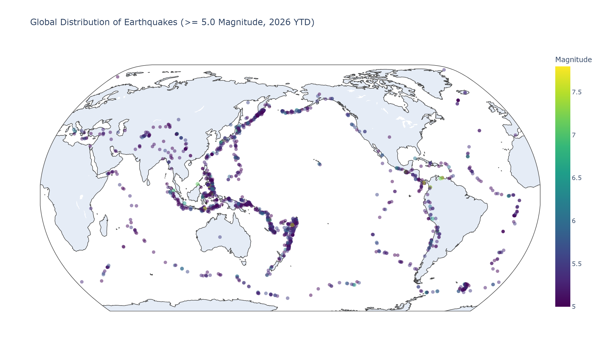
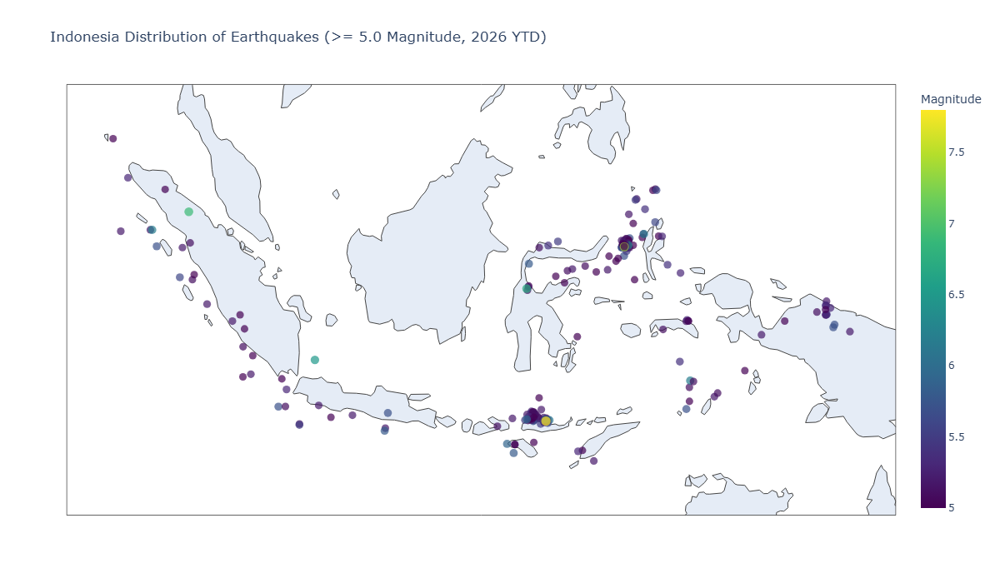
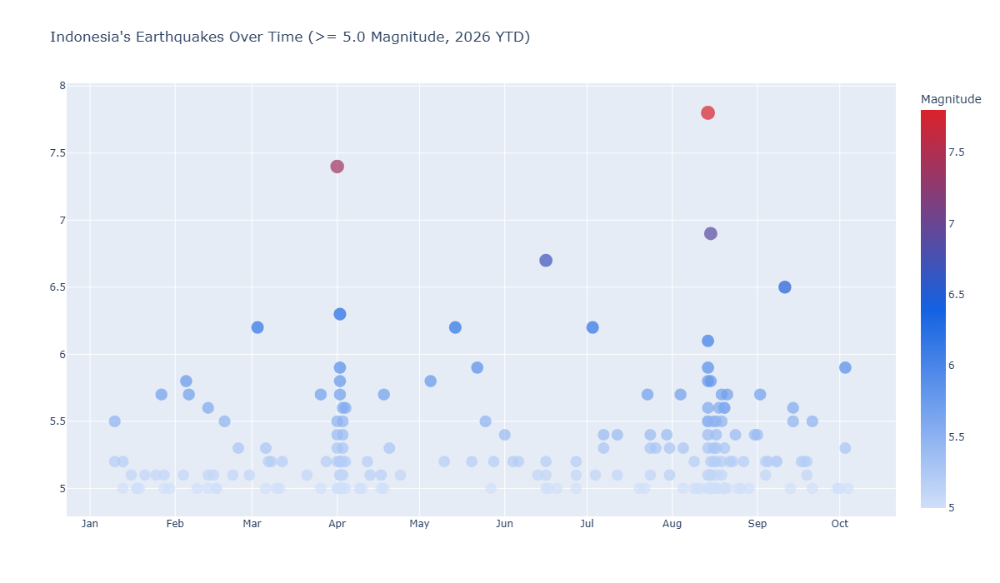
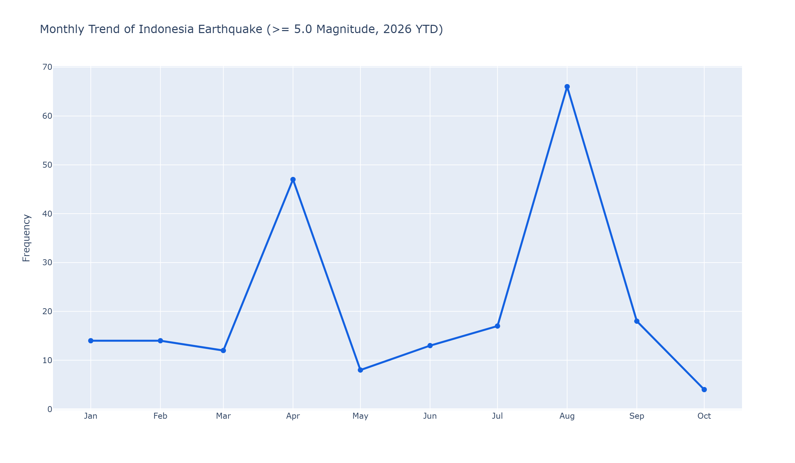
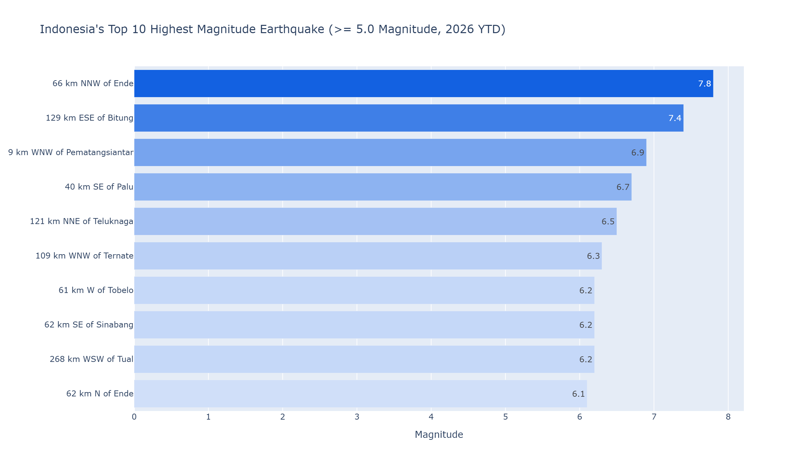

# USGS Earthquake Analysis with Python

## Overview
This project explores seismic activity using the **USGS (United States Geological Survey) Earthquake API** using **Python**. I retrieve earthquake records, transform the API response with **Pandas**, and create interactive visualizations with **Plotly**.

## What I Explored
- Making **API requests** with Python using `requests`
- Handling and parsing **GeoJSON/JSON responses**
- Working with **query parameters** for API filtering and scope
- Transforming and cleaning data with **Pandas**
- Creating interactive geographical maps and charts with **Plotly**

## Data
The data comes from the **USGS Earthquake API**, tracking global and regional seismic activity.

- **Source:** USGS Earthquake API (GeoJSON Feed)
- **Period:** 2026 YTD (year-to-date)
- **Filter Criteria:** Magnitude $\ge$ 5.0 (focused on **moderate and larger earthquakes** as classified by the USGS, filtering out minor background micro-seismicity)
- **Focus Region:** Global & Indonesia

[USGS API Documentation](https://earthquake.usgs.gov/fdsnws/event/1/) provides the reference for the API endpoints, query parameters, and response structure used in this project.

## Process

```text
USGS Earthquake API
     ↓
Custom Python Function (`fetch_eq_api`)
     ↓
GeoJSON Response
     ↓
Pandas DataFrame
     ↓
Clean & Transform
     ↓
Plotly
     ↓
Interactive Visualizations & Previews
```

The project follows a structured workflow from retrieving API data to creating interactive charts:

1. **Extract** earthquake data using a custom Python function (`fetch_eq_api`) with built-in status checks
2. **Filter** records for moderate to major seismic events ($\ge$ 5.0 magnitude) for 2026 YTD
3. **Parse** the GeoJSON response into a Pandas DataFrame
4. **Clean and transform** the data, isolating global then regional subsets (`Indonesia`)
5. **Visualize** the results using Plotly, exporting charts as both interactive HTML files and PNG previews

## Code

The workflow is organized into three stages: **retrieving the data** from the USGS Earthquake API, **transforming it with Pandas**, and **creating visualizations** with Plotly.

### Libraries

The project uses the following Python libraries:

```python
import requests
from datetime import date
import json
import pandas as pd
import plotly.express as px
```

* **requests** for making API requests to the USGS GeoJSON feed
* **datetime** for handling datetime data type
* **json** for inspecting and handling JSON payloads
* **Pandas** for parsing, cleaning, and transforming the earthquake records into DataFrames
* **Plotly Express** for building interactive maps and charts

### 1. Building a Custom API Function

Before requesting any data, a custom function (`fetch_eq_api`) is build to handle the API call and verify the HTTP response status. This keeps the API call modular, readable, and reusable for future requests[cite: 2].

```python
def fetch_eq_api(params):
    """Fetch the earthquake data from USGS API"""

    url = "https://earthquake.usgs.gov/fdsnws/event/1/query"
    r = requests.get(url, params=params)

    if r.status_code == 200:
        print(f"Fetch success: {r.status_code}")
        return r.json()
    else:
        print(f"Fetch FAILED: {r.status_code}")
        return None
```

### 2. Fetching API Data

With the function defined, **query parameters** is passed to the `fetch_eq_api` function to specify the format, date range, and magnitude threshold.

```python
params = {
    'format': 'geojson',
    'starttime': '2026-01-01',
    'endtime': date.today().isoformat(),
    'minmagnitude': 5.0
}

response_dicts = fetch_eq_api(params=params)
print(response_dicts.keys())
print(response_dicts['metadata'])
```
>*This request retrieves earthquake records in **GeoJSON** format starting from **January 1, 2026, to today,** filtering only magnitude of **5.0 or higher** (classified by the USGS as moderate-to-major earthquakes).*

### 3. Inspecting and Extracting the Payload

Inspect a single record, confirming that the data lives inside the `features` key so it can be passed to `response_dict`.

```python
preview_dicts = response_dicts.copy()

if 'features' in preview_dicts:
    preview_dicts['features'] = preview_dicts['features'][:1]
    
print(json.dumps(preview_dicts, indent=4))

# found out the data in feature, pass it to variable
response_dict = response_dicts['features']
```

### 4. Flattening Nested GeoJSON Data

The data we need is deeply nested under `properties` and `geometry`, it cannot be loaded directly into a Pandas DataFrame. Create a loop iterates through each event to extract the magnitude, location, timestamp, and coordinates into a clean list of flat dictionaries.

```python
clean_data = []

for eq in response_dict:
    clean_data.append({
        "magnitude": eq["properties"]["mag"],
        "place": eq["properties"]["place"],
        "time": eq["properties"]["time"],
        "longitude": eq["geometry"]["coordinates"][0],
        "latitude": eq["geometry"]["coordinates"][1],
        "depth": eq["geometry"]["coordinates"][2]
    })
```

### 5. Transforming and Preparing the DataFrame

The data is loaded into a **Pandas DataFrame** and inspected. The raw timestamps are converted into readable dates, and a clean copy (`df_clean`) is saved for analysis and visualization.

```python
df = pd.DataFrame(clean_data)
print(df.head())
print(df.info())
print(df.describe())

df['time'] = pd.to_datetime(df['time'], unit='ms')
df_clean = df.copy()
```
### Full Code

The complete Python script, including the **USGS API requests, GeoJSON parsing, data cleaning, and visualizations**, is available here:

[`earthquake_analysis.py`](earthquake_analysis.py)

The Jupyter Notebook version of the project, including the **code, outputs, and visualizations**, is available here:

[`earthquake_analysis.ipynb`](earthquake_analysis.ipynb)

## Visualizations

The cleaned earthquake data `df_clean` was visualized with **Plotly Express** to map global seismic activity, filter down to regional trends in Indonesia, and track earthquake frequency and top magnitudes throughout 2026 YTD.

### Global Earthquake Distribution Map

This interactive scatter map plots all earthquakes ($\ge$ 5.0 magnitude) recorded worldwide using geographic coordinates to show global seismic patterns.

> ***Click the image below** to open the interactive HTML chart* 

[](https://htmlpreview.github.io/?https://github.com/lazuardi-b/usgs-earthquake-analysis-python/blob/main/charts/01_eq_global_distribution.html)

```python
df_clean['date_clean'] = df_clean['time'].dt.strftime('%Y-%m-%d')

title = "Global Distribution of Earthquakes (>= 5.0 Magnitude, 2026 YTD)"

fig = px.scatter_geo(
    data_frame=df_clean,
    lat='latitude',
    lon='longitude',
    title=title,
    size='magnitude',
    color='magnitude',
    color_continuous_scale='viridis',
    projection='natural earth',
    hover_name='place',
    hover_data={
        'magnitude': ': .1f',
        'date_clean': True,
        'latitude':': .2f',
        'longitude':': .2f'
    },
    labels={
        'date_clean': 'Date',
        'magnitude': 'Magnitude',
        'latitude': 'Latitude',
        'longitude': 'Longitude'
    },
    size_max=6,
    opacity=0.5,
)

fig.update_traces(marker_line_width=0)
fig.show()
```

### Indonesia Earthquake Distribution Map

Filters the global dataset for Indonesia, plotting regional earthquake locations and magnitudes across the country.

> ***Click the image below** to open the interactive HTML chart*

[](https://htmlpreview.github.io/?https://github.com/lazuardi-b/usgs-earthquake-analysis-python/blob/main/charts/02_eq_Indonesia.html)

```python
# df_clean['date_clean'] = df_clean['time'].dt.strftime('%Y-%m-%d')
country_name = 'Indonesia'
df_indonesia = df_clean[df_clean['place'].str.contains(country_name, case=False, na=False)]

title = "Indonesia Distribution of Earthquakes (>= 5.0 Magnitude, 2026 YTD)"

fig = px.scatter_geo(
    data_frame=df_indonesia,
    lat='latitude',
    lon='longitude',
    title=title,
    size='magnitude',
    color='magnitude',
    color_continuous_scale='viridis',
    projection='natural earth',
    hover_name='place',
    hover_data={
        'magnitude': ': .1f',
        'date_clean': True,
        'latitude':': .2f',
        'longitude':': .2f'
    },
    labels={
        'date_clean': 'Date',
        'magnitude': 'Magnitude',
        'latitude': 'Latitude',
        'longitude': 'Longitude'
    },
    size_max=8,
)

fig.update_traces(marker_line_width=0)
fig.show()
```

### Indonesia Earthquakes Over Time

Plots every seismic event in Indonesia chronologically to trace magnitude fluctuations and patterns throughout 2026 YTD.

> ***Click the image below** to open the interactive HTML chart*

[](https://htmlpreview.github.io/?https://github.com/lazuardi-b/usgs-earthquake-analysis-python/blob/main/charts/03_eq_ina_overtime.html)

```python
# df_clean['date_clean'] = df_clean['time'].dt.strftime('%Y-%m-%d')
# country_name = 'Indonesia'
# df_indonesia = df_clean[df_clean['place'].str.contains(country_name, case=False, na=False)]
df_indonesia['place_clean'] = df_indonesia['place'].str.replace(', Indonesia', '', regex=False)
df_timeline = df_indonesia.sort_values('date_clean', ascending=True)

title = "Indonesia's Earthquakes Over Time (>= 5.0 Magnitude, 2026 YTD)"

fig = px.scatter(
    data_frame=df_timeline,
    x='date_clean',
    y='magnitude',
    title=title,
    size='magnitude',           
    color='magnitude',
    color_continuous_scale=['#d0dff9', '#1361e1', '#da2129'],
    hover_name='place',
    size_max=12,
    hover_data={
        'magnitude': ': .1f',
        'date_clean': '|%Y-%m-%d',
        'latitude':': .2f',
        'longitude':': .2f'
    },
    labels={
        'date_clean': 'Date',
        'magnitude': 'Magnitude',
        'latitude': 'Latitude',
        'longitude': 'Longitude'
    },
)

fig.update_xaxes(
    dtick="M1",         
    tickformat="%b",    
    ticklabelmode="instant"
)
fig.update_layout(xaxis_title=None, yaxis_title=None)
fig.update_traces(marker_line_width=0)
fig.show()
```

### Monthly Earthquake Trends in Indonesia

Aggregates earthquake counts by month to illustrate the frequency of seismic events in Indonesia throughout 2026 YTD.

> ***Click the image below** to open the interactive HTML chart*

[](https://htmlpreview.github.io/?https://github.com/lazuardi-b/usgs-earthquake-analysis-python/blob/main/charts/04_eq_ina_monthlytrends.html)

```python
# 4. Monthly Trends
# df_clean['date_clean'] = df_clean['time'].dt.strftime('%Y-%m-%d')
# country_name = 'Indonesia'
# df_indonesia = df_clean[df_clean['place'].str.contains(country_name, case=False, na=False)]
# df_indonesia['place_clean'] = df_indonesia['place'].str.replace(', Indonesia', '', regex=False)
# df_timeline = df_indonesia.sort_values('date_clean', ascending=True)
df_timeline['month'] = pd.to_datetime(df_timeline['date_clean']).dt.to_period('M').astype(str)
monthly_trend = df_timeline.groupby(by='month').size().reset_index(name='count')

title = "Monthly Trend of Indonesia Earthquake (>= 5.0 Magnitude, 2026 YTD)"

fig = px.line(
    data_frame=monthly_trend,
    x='month',
    y='count',
    title=title,
    markers=True,
    hover_data={'count': True, 'month': True},
    labels={'count': 'Frequency'},
)

fig.update_xaxes(
    dtick="M1",         
    tickformat="%b",    
    ticklabelmode="instant"
)
fig.update_layout(xaxis_title=None, yaxis_title='Frequency')
fig.update_traces(
    line=dict(color='#1361e1', width=3),  
    marker=dict(size=8),                 
)
fig.show()
```

### Top 10 Strongest Earthquakes in Indonesia

Ranks the 10 highest magnitude earthquakes recorded in Indonesia throughout 2026 YTD, highlighting the specific locations of the most severe seismic events.

> ***Click the image below** to open the interactive HTML chart*

[](https://htmlpreview.github.io/?https://github.com/lazuardi-b/usgs-earthquake-analysis-python/blob/main/charts/05_eq_ina_top10.html)

```python
# df_clean['date_clean'] = df_clean['time'].dt.strftime('%Y-%m-%d')
# country_name = 'Indonesia'
# df_indonesia = df_clean[df_clean['place'].str.contains(country_name, case=False, na=False)]
# df_indonesia['place_clean'] = df_indonesia['place'].str.replace(', Indonesia', '', regex=False)
df_top10 = df_indonesia.sort_values(by='magnitude', ascending=False).head(10)

title = "Indonesia's Top 10 Highest Magnitude Earthquake (>= 5.0 Magnitude, 2026 YTD)"

fig = px.bar(
    data_frame=df_top10,
    x='magnitude',
    y='place_clean',
    title=title,
    orientation='h',
    text='magnitude',
    color='magnitude',
    color_continuous_scale=['#d0dff9', '#1361e1'],
    hover_name='place',
    hover_data={
        'magnitude': ': .1f',
        'date_clean': '|%Y-%m-%d',
        'latitude':': .2f',
        'longitude':': .2f',
        'place_clean': False
    },
    labels={
        'date_clean': 'Date',
        'magnitude': 'Magnitude',
        'latitude': 'Latitude',
        'longitude': 'Longitude'
    },
)

fig.update_layout(xaxis_title='Magnitude', yaxis_title=None, coloraxis_showscale=False)
fig.update_yaxes(autorange='reversed')
fig.show()
```
## Tools

* **Python** for API requests, data processing, and visualization
* **Requests** for accessing the USGS Earthquake API
* **Pandas** for data transformation and cleaning
* **Plotly Express** for interactive spatial, timeline, line, and bar visualizations
* **VS Code** for development and project work
* **GitHub** for version control and portfolio hosting

## Limitations

* **Single Source Dependency:** The project relies strictly on the USGS API feed. If the service is temporarily unavailable, new data cannot be fetched.
* **Scope Boundary:** The dataset is filtered to earthquakes with a magnitude of 5.0 or greater, omitting micro-seismic activity ($\le$ 5.0) that might show broader regional tectonic movements.

## Future Improvements

* **Automated Cloud Execution:** Deploy the Python script to run automatically on a cloud schedule (e.g., GitHub Actions) so the hosted interactive HTML maps continuously update without needing local execution.
* **Dynamic Regional Inputs:** Wrap the cleaning and plotting code into a reusable function so the entire analysis pipeline can be executed for any target country with a single function call.